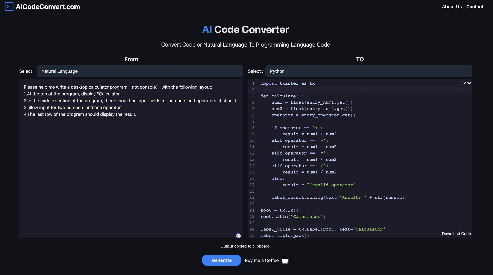
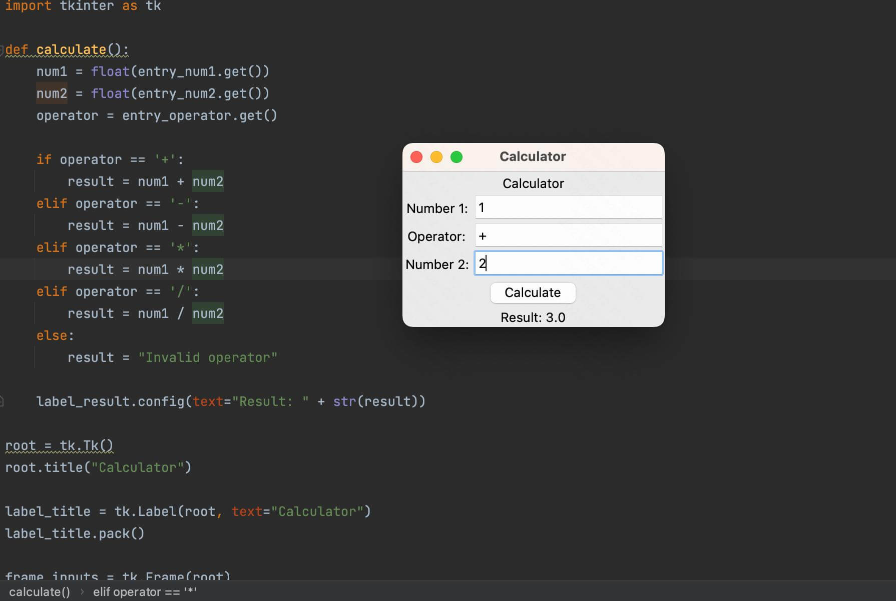
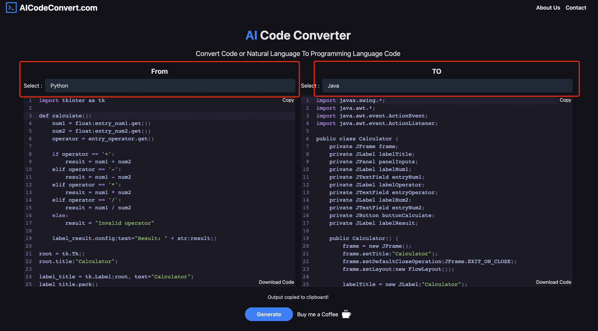
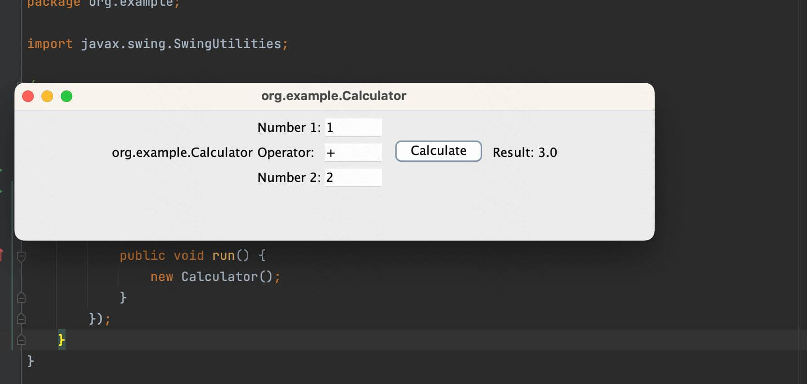

# How to use AICodeConvert?

## If you want to generate code through natural language
Follow these steps:
- Select "Natural Language" in the "From" section.
- Describe your requirements in the description box. Please ensure your description is as detailed as possible. For example, you can list your requirements as follows:
	- XXX
	- YYY
	- ZZZ
### For Example
If I want to use the Python language to generate a simple desktop calculator program, I can describe it as follows:

```json
Please help me write a desktop calculator program（not console） 
with the following layout:
1.At the top of the program, display "Calculator."
2.In the middle section of the program, 
there should be input fields for numbers and operators. It should 
3.allow input for two numbers and one operator.
4.The last row of the program should display the result.

```

The Code：

```python
import tkinter as tk

def calculate():
    num1 = float(entry_num1.get())
    num2 = float(entry_num2.get())
    operator = entry_operator.get()

    if operator == '+':
        result = num1 + num2
    elif operator == '-':
        result = num1 - num2
    elif operator == '*':
        result = num1 * num2
    elif operator == '/':
        result = num1 / num2
    else:
        result = "Invalid operator"

    label_result.config(text="Result: " + str(result))

root = tk.Tk()
root.title("Calculator")

label_title = tk.Label(root, text="Calculator")
label_title.pack()

frame_inputs = tk.Frame(root)
frame_inputs.pack()

label_num1 = tk.Label(frame_inputs, text="Number 1:")
label_num1.grid(row=0, column=0)
entry_num1 = tk.Entry(frame_inputs)
entry_num1.grid(row=0, column=1)

label_operator = tk.Label(frame_inputs, text="Operator:")
label_operator.grid(row=1, column=0)
entry_operator = tk.Entry(frame_inputs)
entry_operator.grid(row=1, column=1)

label_num2 = tk.Label(frame_inputs, text="Number 2:")
label_num2.grid(row=2, column=0)
entry_num2 = tk.Entry(frame_inputs)
entry_num2.grid(row=2, column=1)

button_calculate = tk.Button(root, text="Calculate", command=calculate)
button_calculate.pack()

label_result = tk.Label(root, text="Result: ")
label_result.pack()

root.mainloop()
```



Copy the Code and run it in IDE,



The above is just a simple example, the specifics need to be described realistically, 
but please note that the clearer the description needs to be, the better;

## If you need to convert existing code to another programming language, follow these steps:
- Select the programming language of your original code in the "From" section.
- Choose the target programming language in the "To" section.
- Click the "Generate" button and wait for the code generation to complete.
- Once the generation is finished, you can either choose to "Copy" the code to your clipboard or select "Download Code" to save the generated code.

### For Example

Change The Above Python Code To Java

- Select From => [Python]
- Select To => [Java]
- Click [Generate]



```java
import javax.swing.*;
import java.awt.*;
import java.awt.event.ActionEvent;
import java.awt.event.ActionListener;

public class Calculator {
    private JFrame frame;
    private JLabel labelTitle;
    private JPanel panelInputs;
    private JLabel labelNum1;
    private JTextField entryNum1;
    private JLabel labelOperator;
    private JTextField entryOperator;
    private JLabel labelNum2;
    private JTextField entryNum2;
    private JButton buttonCalculate;
    private JLabel labelResult;

    public Calculator() {
        frame = new JFrame();
        frame.setTitle("Calculator");
        frame.setDefaultCloseOperation(JFrame.EXIT_ON_CLOSE);
        frame.setLayout(new FlowLayout());

        labelTitle = new JLabel("Calculator");
        frame.add(labelTitle);

        panelInputs = new JPanel();
        panelInputs.setLayout(new GridLayout(3, 2));

        labelNum1 = new JLabel("Number 1:");
        panelInputs.add(labelNum1);
        entryNum1 = new JTextField();
        panelInputs.add(entryNum1);

        labelOperator = new JLabel("Operator:");
        panelInputs.add(labelOperator);
        entryOperator = new JTextField();
        panelInputs.add(entryOperator);

        labelNum2 = new JLabel("Number 2:");
        panelInputs.add(labelNum2);
        entryNum2 = new JTextField();
        panelInputs.add(entryNum2);

        frame.add(panelInputs);

        buttonCalculate = new JButton("Calculate");
        buttonCalculate.addActionListener(new ActionListener() {
            @Override
            public void actionPerformed(ActionEvent e) {
                calculate();
            }
        });
        frame.add(buttonCalculate);

        labelResult = new JLabel("Result: ");
        frame.add(labelResult);

        frame.pack();
        frame.setVisible(true);
    }

    private void calculate() {
        double num1 = Double.parseDouble(entryNum1.getText());
        double num2 = Double.parseDouble(entryNum2.getText());
        String operator = entryOperator.getText();

        double result;
        if (operator.equals("+")) {
            result = num1 + num2;
        } else if (operator.equals("-")) {
            result = num1 - num2;
        } else if (operator.equals("*")) {
            result = num1 * num2;
        } else if (operator.equals("/")) {
            result = num1 / num2;
        } else {
            result = Double.NaN;
        }

        labelResult.setText("Result: " + result);
    }

    public static void main(String[] args) {
        SwingUtilities.invokeLater(new Runnable() {
            @Override
            public void run() {
                new Calculator();
            }
        });
    }
}
```
