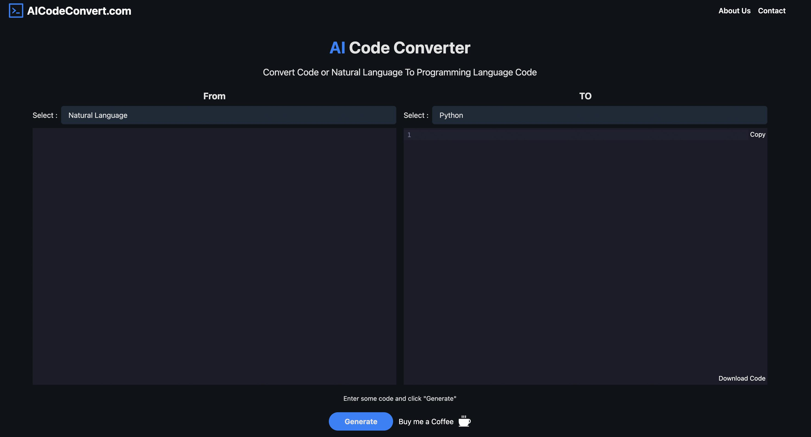

# What is AICodeConvert

Welcome to AICodeConvert, 
a cutting-edge tool for the future of intelligent code transformation! 
We bring you unprecedented innovation that makes code writing and conversion smarter and more efficient. 
Whether you want to translate natural language into code or need to convert code from one programming language to another, 
AICodeConvert is here to empower you.

## Features

### AICodeGenerator: Transform Natural Language into Code

Imagine generating precise code implementations with just your natural language descriptions. 
AICodeConvert's AICodeGenerator module employs advanced artificial intelligence technology to transform your ideas into code, 
freeing you from the hassle of writing intricate code. 
Whether you're a beginner or an experienced developer, it's a game-changer.

### AICodeTranslator: Multi-Language Code Conversion

Confronted with the challenges of different programming languages?
No worries! AICodeConvert's AICodeTranslator module boasts robust cross-language conversion capabilities, 
seamlessly translating code from one language to another. 
Say goodbye to manually converting code—let AI swiftly handle the transformation, 
so you can focus on creative development work.

